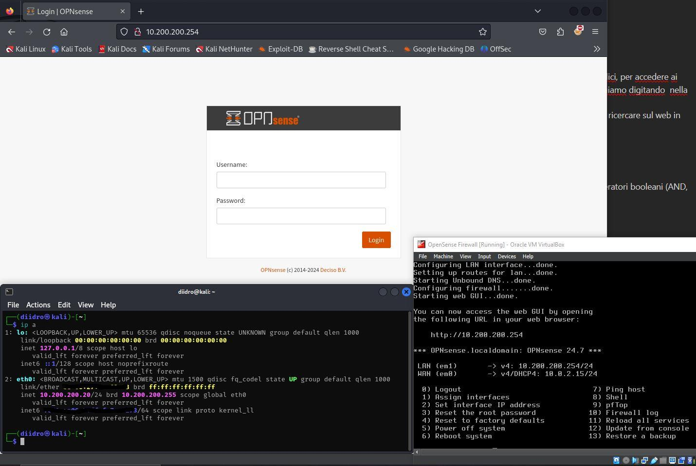
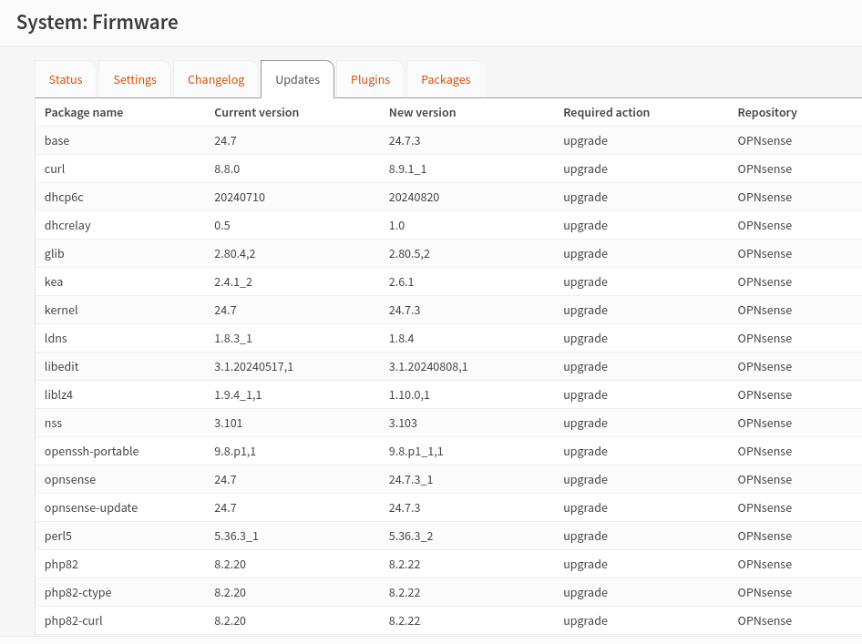
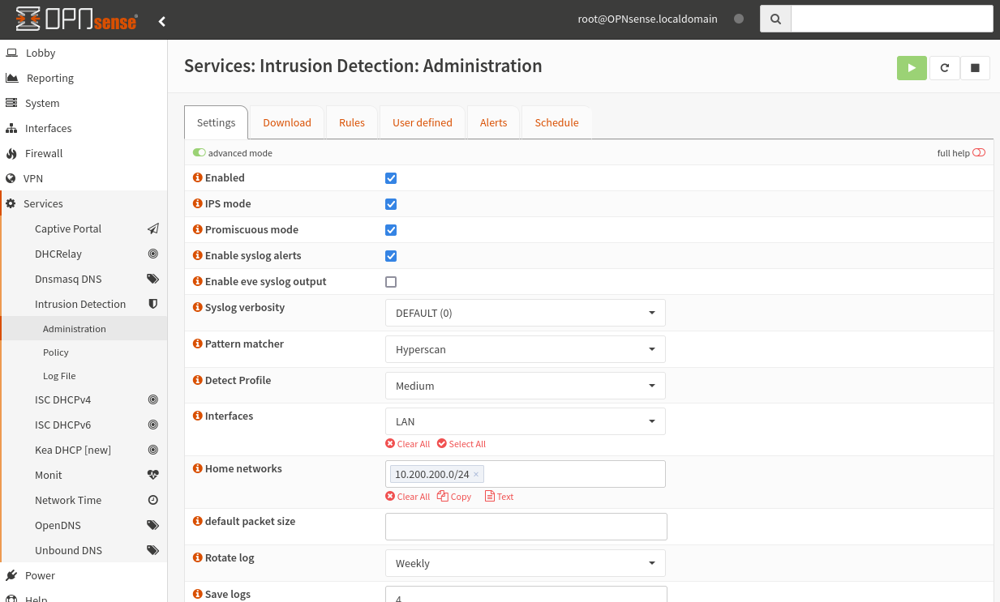
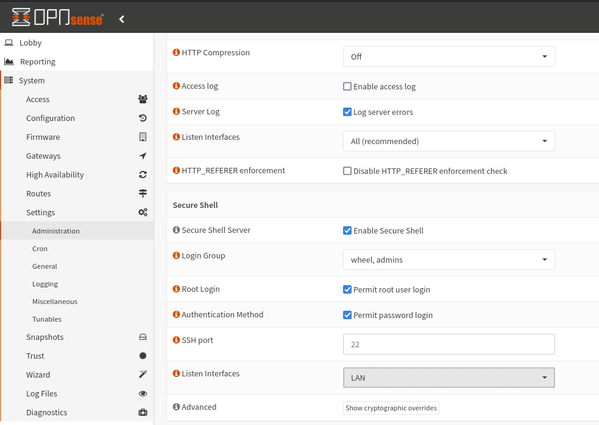
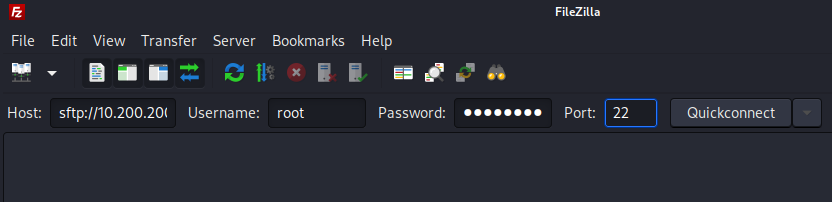
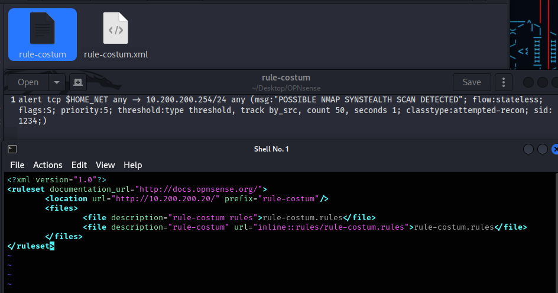
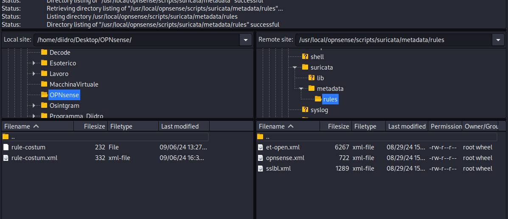
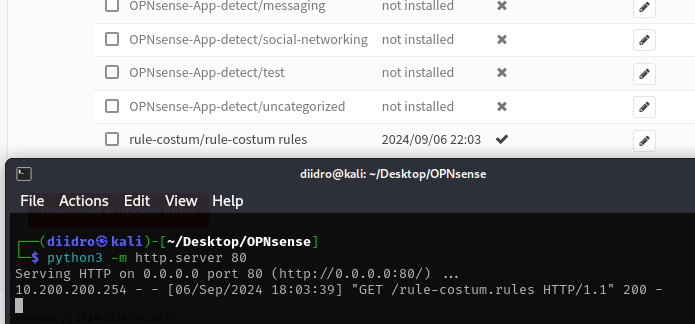
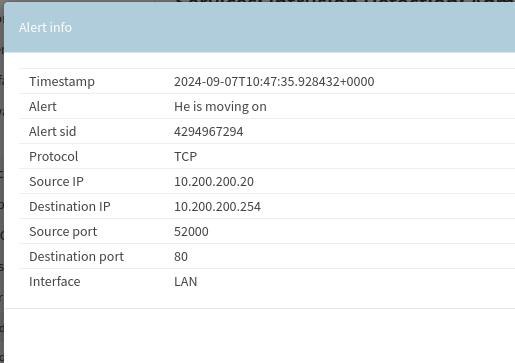

# Starting Point + Surricata (IDS/IPS)

Before following the tutorial you will have to create a virtual machine with Kali Linux, make sure it is on the internet, and go (from your host machine) to this [link](https://opnsense.org/download/)  to download OPNsense.
The download is quite intuitive.

If your host is a Windows machine you may encounter some difficulty decompressing the file you just downloaded.

Once you have downloaded opnsense you should notice, in fact, how it has been compressed in a "non-canonical" way, you can decompress this file by downloading bzip2. 
Downloaded from the official website, using powershell you can go to the folder where the OPNsense was downloaded and unzip it:


( .\bunzip2.exe —help to get an overview of the objects you can use).

Continue independently with the installation of this new machine (now you have the file) and configure the LAN and WAN.

# Tips and checks

If you have never configured something like this you can search YouTube for tutorials relating to the first start of OPNsense/PFsense; once the initial configuration has been done, return to this page to align with the screen below and continue with the guide.

During configuration you will be asked if you want to activate the GUI, click yes and, once everything is configured, write the IP entered in the LAN configuration in the browser URL.




# Update

Once logged in (the default credentials are id:root, pw:opnsense) we need to update everything, then go to system, firmware, status and click check for update.

After confirming the update, since we are working on virtualbox, we will have to install the os-virtualbox plugin which, post-update, we find in the appropriate section.
This operation is also quite intuitive, click on the "add" button located in the same line as the plugin concerned and follow the guided path.



# Surricata

To install the intrusion detection system on opnsense just go to Service, Intrusion Detection, Administration and go to advanced mode.
By clicking on the "i" next to the setting title you can obtain an explanation regarding the function; alternatively you can click on "Full help" to get additional information on each individual field.

NB: As a pattern matcher I selected Hyperscan because it is more modern and optimized to work with modern processors (as well as supporting strong parallelization and being highly scalable). 
It is perfect for working with Snort and Surricata.



Let's continue now by creating the firewall rules. 

In the first example, just for demonstration, I will create a rule by hand from CLI and import it to OPNsense; in the second example, however, we will use the OPNsense GUI, a quicker and more intuitive method.

# From CLI

Our rule will be as follows:
```
alert tcp $HOME_NET any -> 10.200.200.254/24 any (msg:"POSSIBLE NMAP SYNSTEALTH SCAN DETECTED"; flow:stateless; flags:S; priority:5; threshold:type threshold, track by_src, count 50, seconds 1; classtype:attempted-recon; sid:1234;)
```

- alert, is the action that will be performed;
- tcp, is the protocol;
- $HOME_NET, will be a "placeholder" for our "home network".
- any -> 10.200.200.254/24, all traffic directed towards our firewall

So far we say that all the traffic arriving from the home network on the TCP protocol (on each port) directed towards the firewall must generate a message saying that it is a possible nmap stealth scan (detected).

OT: namp is used for information ghetering by hackers, it's one of the first steps.

- flow:statless, indicates the stateless state, it is based exclusively on the individual configured rules, the packets are analyzed individually;
- flag:S, is the tcp flag, the S indicates SYN (syn stealth scans work as if they were sending syn requests to the server but the three-way-handshake is never completed obtaining half-open connections).

  


















[You can continue with chapter 2!](./Chapter2-HL.md).
