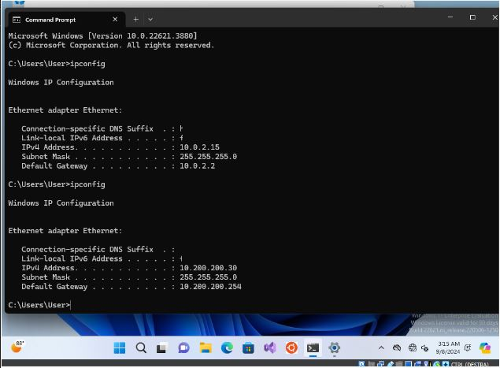
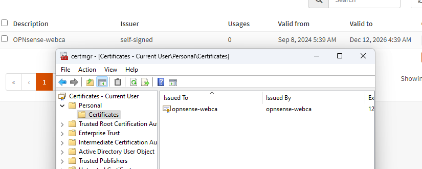

# Trasparent Proxy

## Proxy and Web-Filter
Let's assume that there is an employee in the company who wastes time on social media instead of working, we could put restrictions on this individual in order to reduce distractions.
We can solve this task with the “transparent proxy feature”.

The **Transparent Proxy** feature in **OPNsense** allows you to filter network traffic without requiring any configuration on client devices.

Unlike a traditional proxy, which requires manual configuration of clients to route traffic through the proxy, a transparent proxy automatically intercepts network traffic passing through the firewall, particularly HTTP/HTTPS traffic, and redirects it to the proxy for filtering or management.
The strong points of this product are:

- **Intercept traffic automatically**
- **Filter content and traffic**
- **Traffic logging**
- **Support for HTTPS (SSL Interception)**
- **Resource Optimization,** provides scalability as it can temporarily store web pages and static resources, then return them to the client when requested without having to download them again.

The proxy feature is based on a well-known proxy: **Squid-cache**, thanks to him we have a local cache proxy increasing scalability.
Filtering, however, comes from the **Squid-guard** function.

---

Before continuing, we must create a **trusted certificate authority** on our opnsense firewall, this will be necessary for the ssl transparent proxy setup.
We can create the certificate by going to System, Trust, Authorities and clicking the + to generate a new one. Fill in all the required fields.

Once generated, we need to import this certificate to our machine as well (it's only on opnsense at the moment).
We download the certificate on a machine different from Kali, perhaps some version of Windows (the download and installation of the certificate is very intuitive on Windows).
Remember to set the right network (if you have problems installing the Windows 11 ISO you can download the OVA from the official Microsoft website).

The certificate will be downloaded in .pem, to install it just go to "Manage user certificates" (from the system search bar), go to personalin, right click, all task, import (remember to put all the extensions or the .pem will not be printed on the screen in the search).

# Web-Proxy

If you have not done so previously, move to firmware, plugins, and install os-squid (plugins appear after the first update).

Going to Service Squid Web Proxy, which now appears, we set it as follows:

The appearance of the menu at the top right will be proof of correct application.
By moving to forward Proxy we can continue with our configuration. 

NB: Be careful when you enable the transparent HTTP proxy, you will have to add an attached firewall rule; similarly add the HTTPS rule for SSL inspection.

Remember to apply your changes before leaving the port forward rules page.

Continuing to set up Squid, remember to use as CA what we have previously created and imported into the machine.

Finally we are at the SSL no dump sites option. 
We must think of this proxy as a man in the middle between clients and destinations, this section allows us to add URLs and all the subdomains that we do not want to be proxyed via the SSL proxy (it will be bypassed and will keep communication intact).
Things to exclude should be things related to banks and the like.

However, we are not done yet, we need to move to "Remote access control list" to load a blacklist.
Going to the + will open an interactive screen to fill in, as URL I'll leave you the one that I will use myself, the URL is taken from the University of Toulouse (France) since they have a department dedicated to updating the same list.

[Blacklists UT1](https://dsi.ut-capitole.fr/blacklists/index_en.php)

From here you can identify the lists that interest you, copy the destination link and insert it into opnsese.

[You can continue with chapter 3!](./Chapter3-HL.md).
