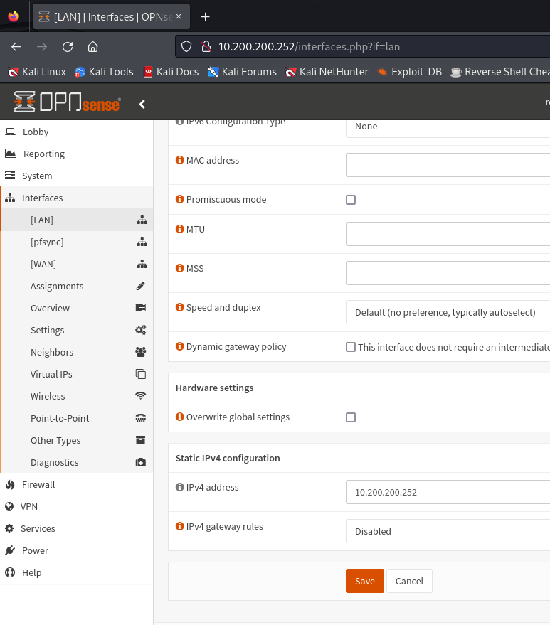
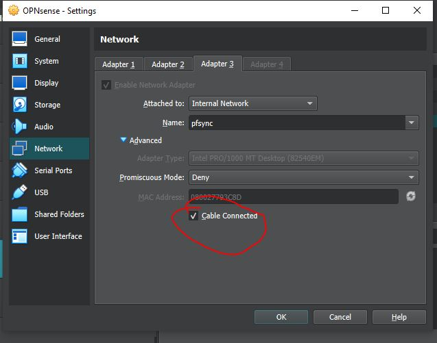

# Redundancy and High Availability Firewall (HA)

Let's now focus on ensuring redundancy.
It is not uncommon that due to various problems the functionality of a firewall and all the functions attached to it may fail. This represents a great risk to productivity (it breaks the CIA Triad of Airworthiness principle), which is why it is important to undertake preventive activities.

Let's analyze the network design that we are going to create.

The basic idea is to create a "Failover", i.e. a technique aimed at providing for automatic switching to a similar (redundant) or standby structure in the event of an anomalous failure/interruption in the functioning of a hardware/network component.
Failover occurs automatically (unlike switchover which requires human intervention).

With Master we indicate our main, the one who will be operational by default; with backup, however, the one who will come into play when the first one goes off.
The two firewalls are connected to a virtual switch (layer2) which represents our LAN where the virtual clients connect.
With this configuration, users will not realize that one of the two firewalls has gone offline.

NB: If you want further information on what we are doing, search for the CARP protocol (Common Address Redundancy Protocol), a protocol that communicates via multicast packets, in this case it will inform the two firewalls of the counterparty's status.

# Explanation of IPs and logic

The CARP will use the IP inserted in the image between the two firewalls (10.200.200.254/24), this means that the client on the LAN will use the one shown above as the default gateway; while the virtual IP of the wan will use the gateway 10.0.2.254.
In our case we will create a group "2" for the virtual IP on the WAN; and a group “1” for the virtual IP on the LAN.

The “Skew”, set to 0 on the master and 100 on the backup, is the index of a value representing the priority; the road with the lowest Skew value will be preferentially chosen.

The last thing to explain is the pfSync protocol located between the two firewalls, this protocol is used to create a direct connection between the two, it runs on the 10.0.0.0/24 network (you see it in the image), it's used to synchronize firewall states between machines running Packet Filter (PF) for high availability. 
It is used along with CARP to make sure that the backup firewall has the same information as the main firewall. 
When the main machine in the firewall cluster dies, the backup machine is able to accept current connections without loss.

Creating an isolated and dedicated network between the two firewalls is a best practice since, in addition to giving better performance, it can prevent state injection or state manipulation.
All these communications take place thanks to the xml rpc protocol, a protocol dedicated to executing remote procedure calls and exchanging information between servers via the internet.

# Practice

