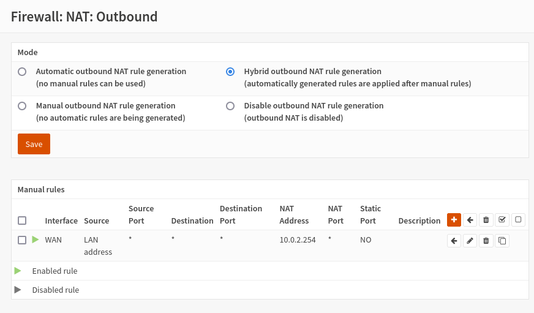
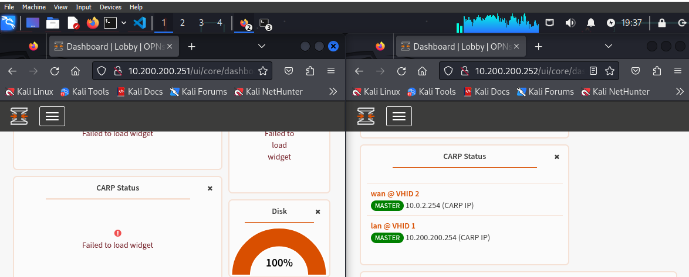
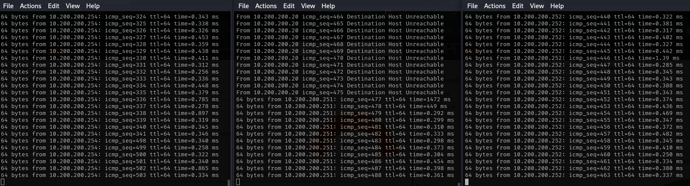
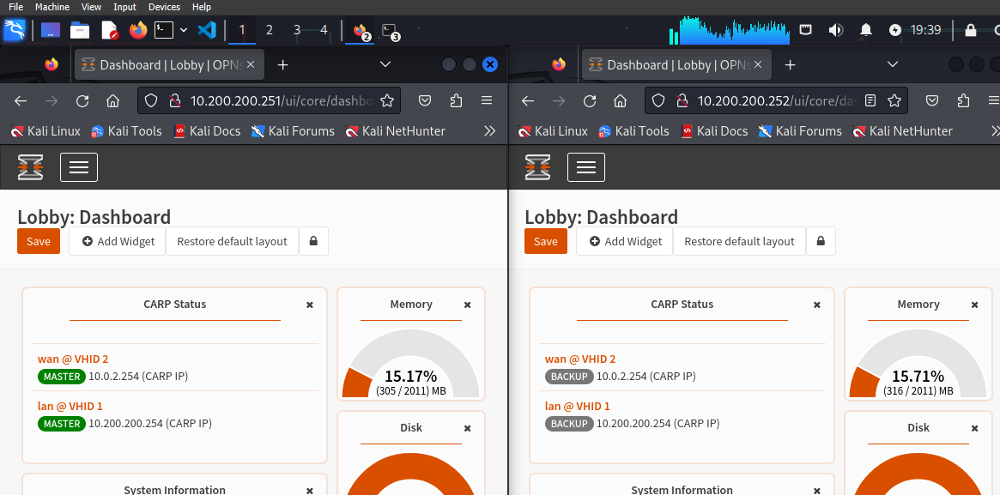

# Redundancy and High Availability Firewall (HA)

Let's now focus on ensuring redundancy.
It is not uncommon that due to various problems the functionality of a firewall and all the functions attached to it may fail. This represents a great risk to productivity (it breaks the CIA Triad of Airworthiness principle), which is why it is important to undertake preventive activities.

Let's analyze the network design that we are going to create.

The basic idea is to create a "Failover", i.e. a technique aimed at providing for automatic switching to a similar (redundant) or standby structure in the event of an anomalous failure/interruption in the functioning of a hardware/network component.
Failover occurs automatically (unlike switchover which requires human intervention).

With Master we indicate our main, the one who will be operational by default; with backup, however, the one who will come into play when the first one goes off.
The two firewalls are connected to a virtual switch (layer2) which represents our LAN where the virtual clients connect.
With this configuration, users will not realize that one of the two firewalls has gone offline.

NB: If you want further information on what we are doing, search for the CARP protocol (Common Address Redundancy Protocol), a protocol that communicates via multicast packets, in this case it will inform the two firewalls of the counterparty's status.

# Explanation of IPs and logic

The CARP will use the IP inserted in the image between the two firewalls (10.200.200.254/24), this means that the client on the LAN will use the one shown above as the default gateway; while the virtual IP of the wan will use the gateway 10.0.2.254.
In our case we will create a group "2" for the virtual IP on the WAN; and a group “1” for the virtual IP on the LAN.

The “Skew”, set to 0 on the master and 100 on the backup, is the index of a value representing the priority; the road with the lowest Skew value will be preferentially chosen.

The last thing to explain is the pfSync protocol located between the two firewalls, this protocol is used to create a direct connection between the two, it runs on the 10.0.0.0/24 network (you see it in the image), it's used to synchronize firewall states between machines running Packet Filter (PF) for high availability. 
It is used along with CARP to make sure that the backup firewall has the same information as the main firewall. 
When the main machine in the firewall cluster dies, the backup machine is able to accept current connections without loss.

Creating an isolated and dedicated network between the two firewalls is a best practice since, in addition to giving better performance, it can prevent state injection or state manipulation.
All these communications take place thanks to the xml rpc protocol, a protocol dedicated to executing remote procedure calls and exchanging information between servers via the internet.

# Practice

The first thing we need to do is create the backup opnsense.
The quickest way to do this is to clone the opnsense we already have, giving it a different name.

Once this is done, let's move to the virtualbox tools item (on top), and click network to create a nat-network (virtualbox network)

Once we have created a default one, we have to go to properties and modify the IPv4 as in the image (activate DHCP).
The advantage of putting a Nat-network over a normal one is that the Nat-network allows us to communicate with all the devices in the network as if it were a layer2; this network has its own dhcp server and its own gateway giving us access to the internet equally.
If we left a simple NAT, which is the default on virtualbox, the devices would not be able to communicate with each other even if they appear on the same IP address.

Once this NAT-network has been generated, let's apply it on our firewalls (put allow a promiscuous mode):

Also on the second adapter you need to set the promiscuous mode to Allow all; finally, you need to add the third network adapter as in the image below:

The same changes must be made on both opnsenses.
Once this is done we are ready to start the machines, starting with the backup to avoid IP address conflicts: as soon as we log in we should change the IP address to 10.200.200.252 (being a clone it starts with the same IP address) of the LAN.

To do this we access the GUI through our windows and go to Interfaces, LAN to make the change (and save it).

Once this is done we start our master and, in a similar way, put it with a LAN IP of 10.200.200.251

We are now ready to configure the pfsync network. Before proceeding, going to overview, let's make sure we have this layout:

Let's give the static IPv4 as in the figure to the two pfsync, the procedure is similar to the previous images.

---

By going to Firewall, Rules, pfsync we are going to enable traffic between these two pfsync (opnsense blocks them by default), an action to be taken both on the main and on the backup.

All we have to do is configure the virtual IPs that you find in the Interfaces section, and on setting you will create a new rule. 
The reference values ​​are:
- Mode: CARP
- Interface: LAN
- Address: 10.200.200.254/24
- Password:
- VHID Group: 1
- advbase: 1
- advskew: 0 (on the main); 100 (on the backup)
- Description: VIP LAN;

Repeat the operation for the WAN, references:

- Address: 10.0.2.254/24
- VHID Group: 2
- Description: VIP WAN;

Done both on main and backup do apply.

# High Availability 
Let's now continue with configuring high availability on both the master and the backup; you can do this by going to system, high availability, setting.

Once here you must activate synchronizate States, interface pfsync, IP the one of the backup firewall 10.0.0.2 (if you are on main, otherwise vice versa); fill in with the username and password used to log in to opnsense and check all the boxes below to indicate total synchronization.

We can conclude by defining a specific rule for the outbound NAT aimed at specifying that both firewalls must use the virtual IP address that we have set (10.0.2.254) and that, therefore, they must have a net translation from our LAN IP address.
To do this we go back to the master and go to firewall, nat, outbound.
By default we will find the "Automatic outbound NAT rule generation" option checked, we must put "Hybrid outbound NAT rule generation"; and then add a rule, on this same interface, which says that everything coming from the LAN (10.200.200.254) must be translated to 10.0.2.254.

Everything has been set!
From the dashboard we can add the CARP status widget, let's put it on both firewalls because it will help us see something very interesting in the practice we are about to start!
In the URL you can see the IP, in the widget, however, the master and backup tag:

