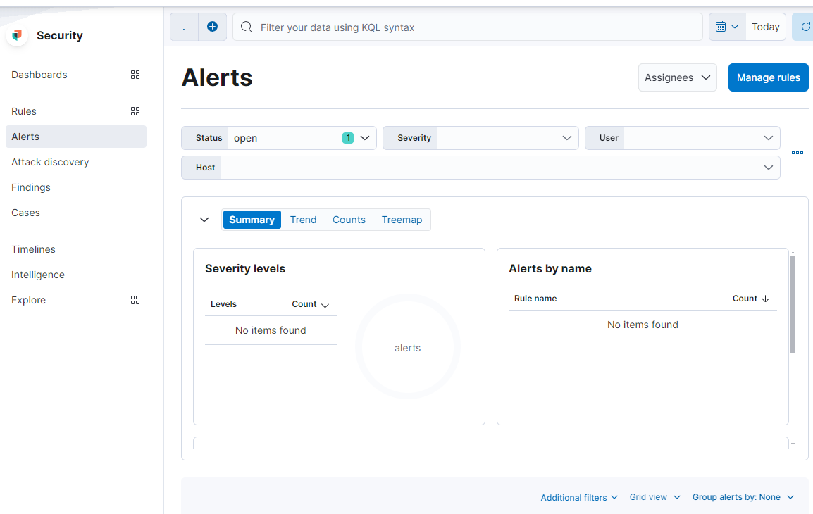
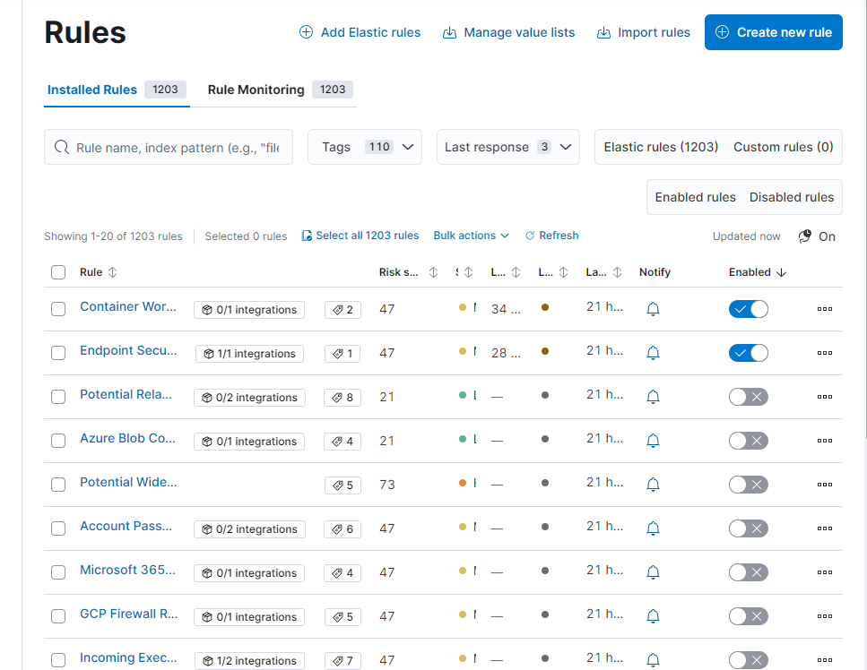
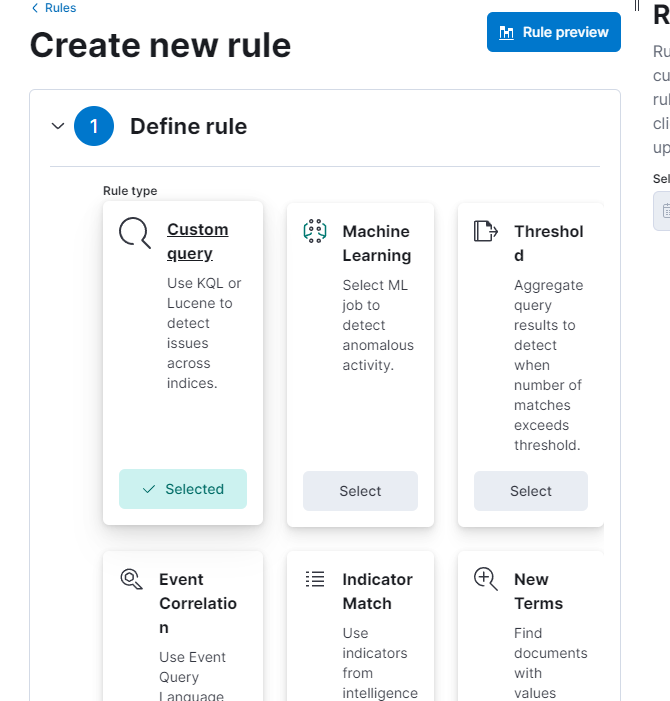
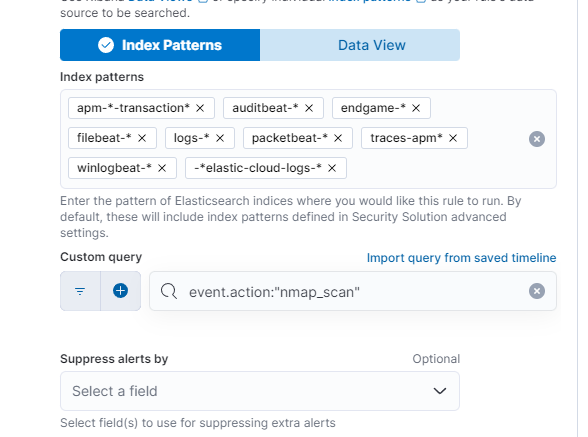
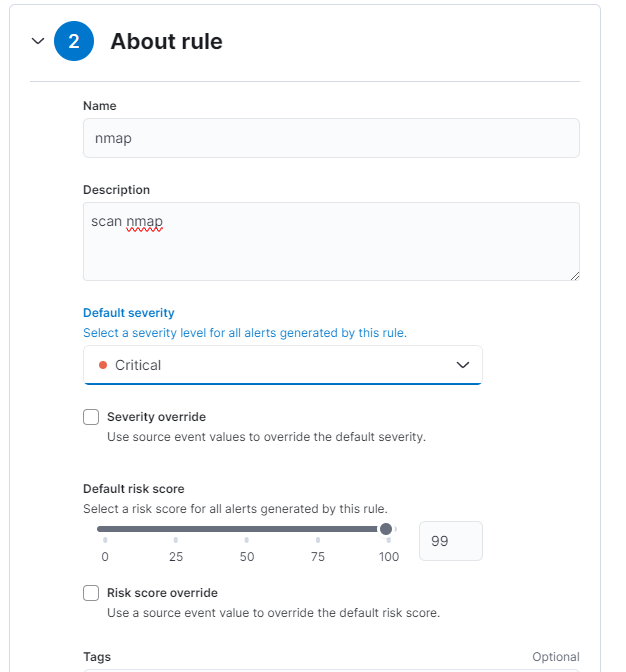
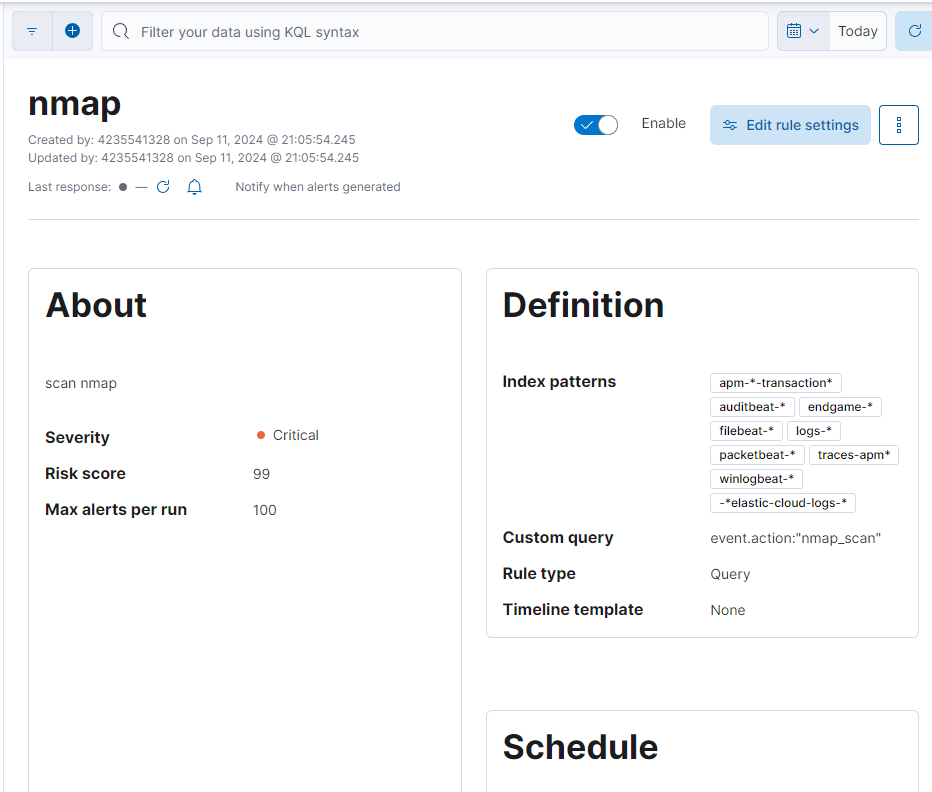

## Create an Alert

In a SIEM, alerts play a vital role in identifying security incidents and ensuring a quick response. 
These alerts are generated according to preset rules or personalized queries and can be set up to initiate specific actions when particular criteria are met. 

In this task, we will go over the process of setting up an alert in the Elastic SIEM to detect Nmap scanning activity. 
By completing these steps, you will be able to configure an alert that monitors your logs for Nmap scan events and provides notifications when such scans are detected.

From the homepage click on the security macro-section and then open the drop-down menu and enter "Alerts".

Let's move to Manage rule (top right) and it will automatically take us to the "Rules" section.
We then click the blue "Create new rule" button to move to the new interface.

Let's define the new rule. We select "Custom query", scroll down and enter the name of the Custom Query.

We continue by setting the "About rule", the "Schedule rule" and, finally, the "Rule actions".

Once everything is finished we will have an overview of our new rule.

Congratulations, you just learned the basic movements in a SIEM!
