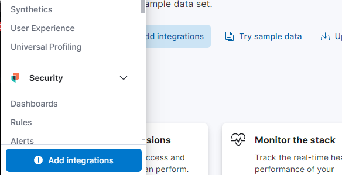
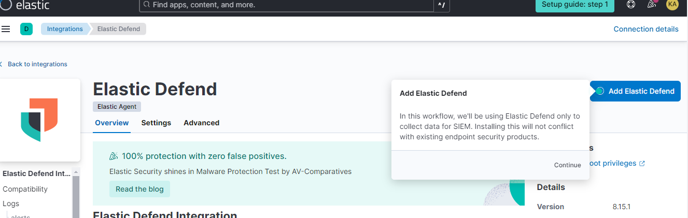
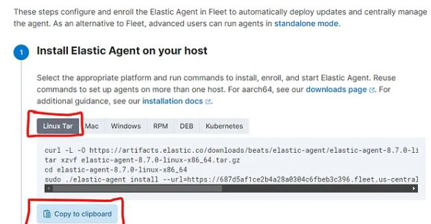
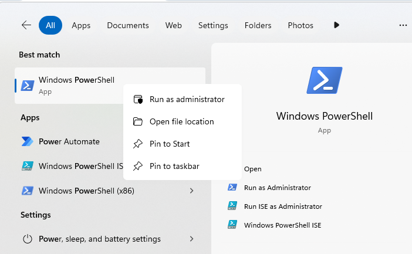
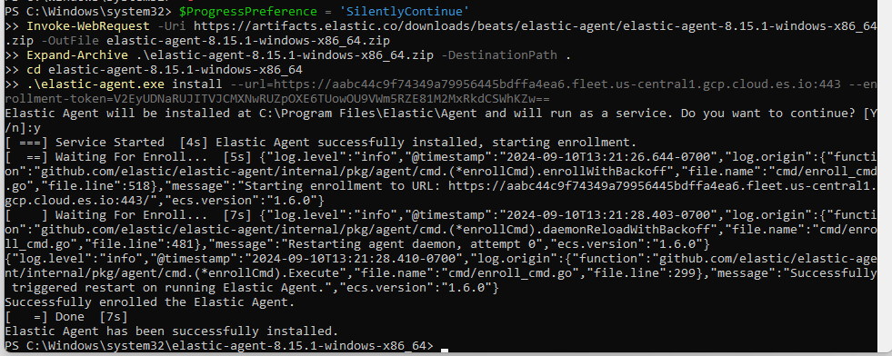
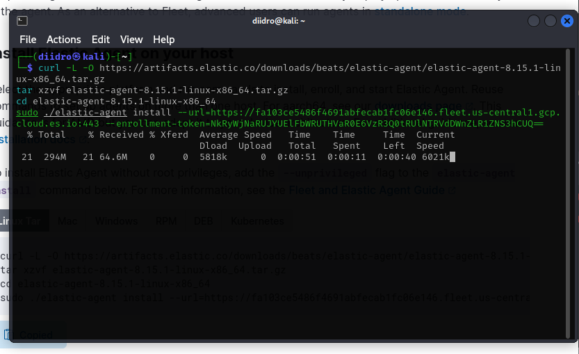
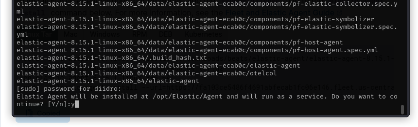
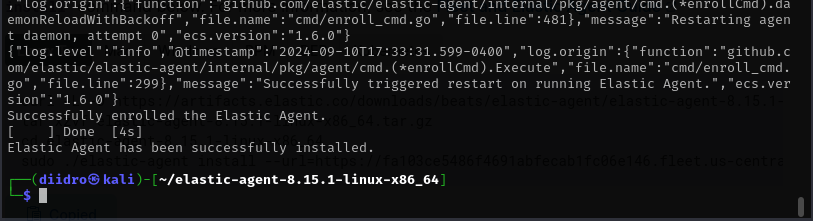
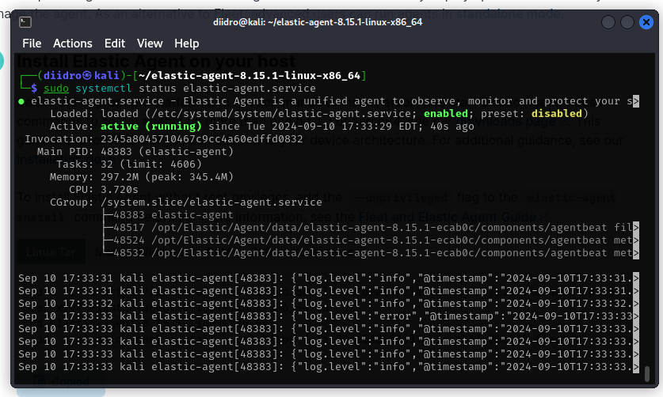

## Account creation

The first thing to do is to create a free account, a credit card is not required, [here](https://cloud.elastic.co/registration)

Once registered click on the "Create Deployment" button and select "Elasticsearch" as the deployment type.
Choose a region and deployment size that fits what you want and click on "Create Deployment".
Wait for the configuration to complete, then click "continue".

## Activation of kali to set the agent that will collect the logs

An agent is a software program that is installed on a device, such as a server or endpoint, to collect and send data to a centralized system for analysis and monitoring. 
To set up the agent to collect logs from your Kali VM and forward them to your Elastic SIEM instance, we have to log in to our SIEM instane and navigate to the Integrations page clicking on the Kibana main menu bar at the top left to choose "Integrations" at the bottom. 

Search for “Elastic Defend” and click on it to open the integration page (Add Elastic Defend), follow the guided process to the agent installation page.

A window like this should appear, let's see where to insert these scripts to install the agent on our host.
Let's analyze the installation on Windows, first, and on Kali, after.

### Windows
We have to open the powershell as administrator and insert the code that elastic recommends. 
Then, we have to confirm the installation by typing "y".

We will receive a success message when the installation is complete.

### Kali Linux

We paste the command, as previously done for windows, into the kali terminal (you can open it with ctrl+alt+t) 

Here too we should confirm the intention to install the agent with "y"

Similarly, we would eventually have a success message.

To confirm whether the service is active we can use the command:
sudo systemctl status elastic-agent.service

The environment is ready, we can finally start working.

[You can continue with chapter 2!](./Chap2-siem.md).

###
