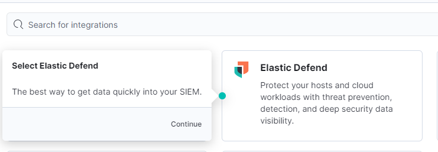

## Account creation

The first thing to do is to create a free account, a credit card is not required, at https://cloud.elastic.co/registration

Once registered click on the "Create Deployment" button and select "Elasticsearch" as the deployment type.
Choose a region and deployment size that fits what you want and click on "Create Deployment".
Wait for the configuration to complete, then click "continue".

## Activation of kali to set the agent that will collect the logs

An agent is a software program that is installed on a device, such as a server or endpoint, to collect and send data to a centralized system for analysis and monitoring. 
To set up the agent to collect logs from your Kali VM and forward them to your Elastic SIEM instance, we have to log in to our SIEM instane and navigate to the Integrations page clicking on the Kibana main menu bar at the top left to choose "Integrations" at the bottom. 

