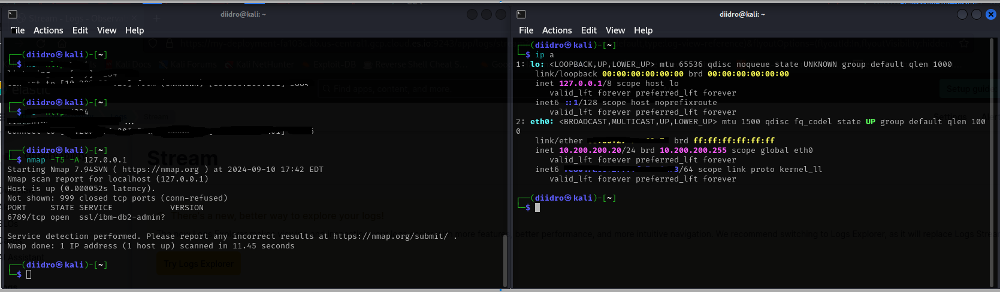

### Let's trigger some security events

To verify that the agent is working correctly, you can generate some security-related events on your Kali VM. To do this, we can use a tool like Nmap.
Nmap can be used to scan hosts for open ports, determine the operating system and software running on the target system, and gather other information about the network.

Since we are using only one virtual machine, we can make a scan towards our localhost (you can see it by typing ip a in the terminal, the loopback is 127.0.0.1) trying to add various objects to the command.

### Querying for Security Events in the Elastic SIEM

Now that we have forwarded data from the Kali VM to the SIEM, we can start querying and analyzing the logs in the SIEM.

