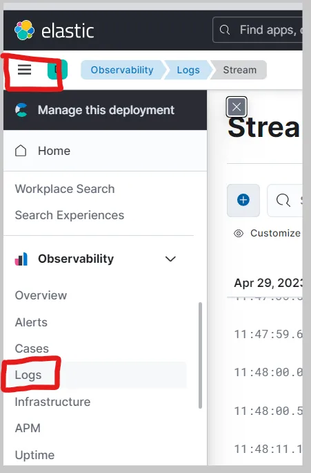
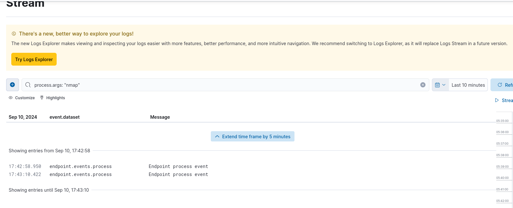
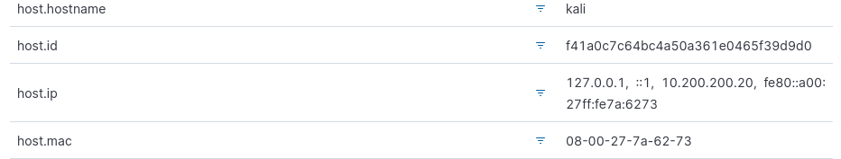
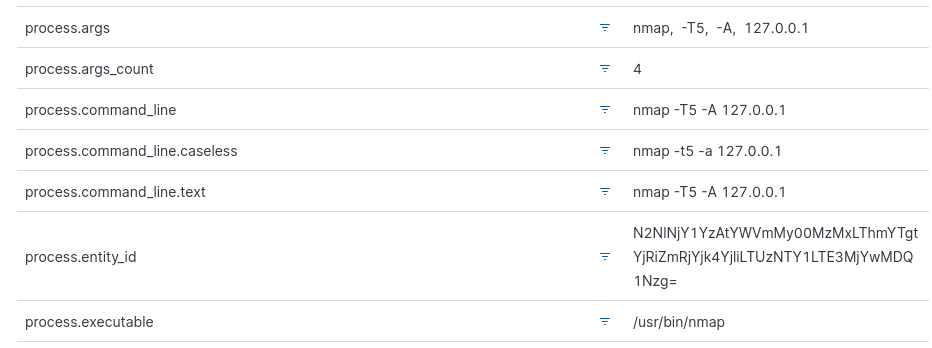

### Let's trigger some security events

To verify that the agent is working correctly, you can generate some security-related events on your Kali VM. To do this, we can use a tool like Nmap.
Nmap can be used to scan hosts for open ports, determine the operating system and software running on the target system, and gather other information about the network.

Since we are using only one virtual machine, we can make a scan towards our localhost (you can see it by typing ip a in the terminal, the loopback is 127.0.0.1) trying to add various objects to the command.

### Querying for Security Events in the Elastic SIEM

Now that we have forwarded data from the Kali VM to the SIEM, we can start querying and analyzing the logs in the SIEM.
Inside your Elastic Deployment, click on the menu icon at the top-left with the three horizontal lines and then click on the “Logs” tab under “Observability” to view the logs from the Kali VM.

We can enter in the search bar a query to filter the logs, for example, **event.action:"nmap"**
Click on "Search" button to execute the search query (it can take a while for the events to populate and show up on the SIEM).

You will see something like this:

By moving the mouse cursor over an event, three dots will appear on the left, by clicking them you can get information about the host IP, the command executed and similar.

[You can continue with chapter 3!](./Chap3-siem.md).
