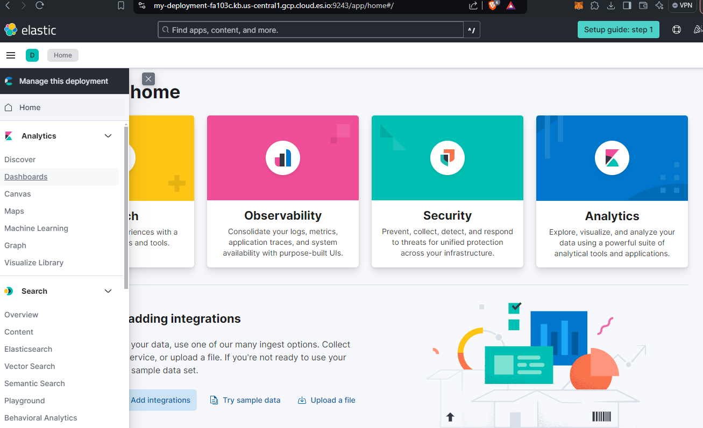
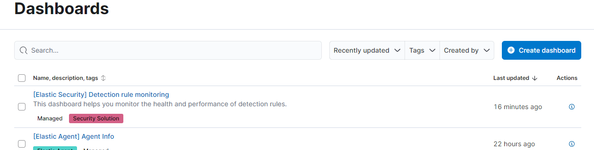
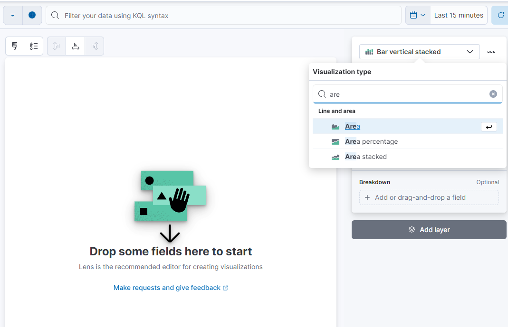
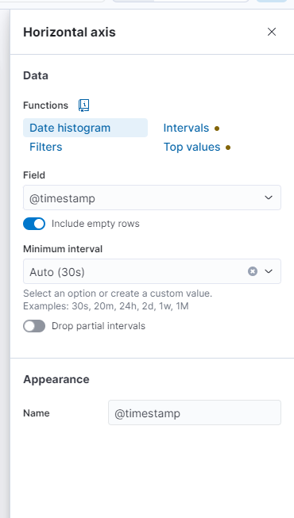
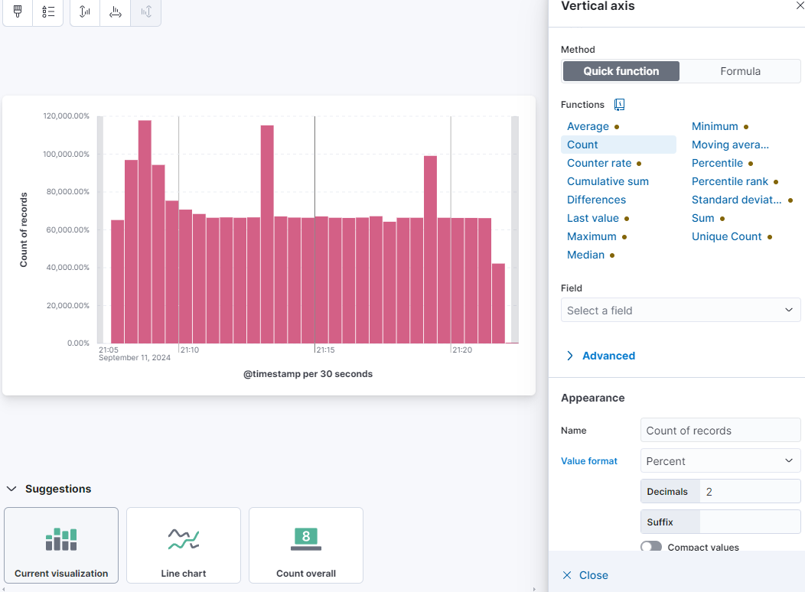

## It's time to generate a basic Dashboard

You can also use the visualizations and dashboards in the SIEM app to analyze the logs and identify patterns or anomalies in the data. For example, you can create a simple dashboard that shows a count of security events over time.

Let's do that:
Let's go back to our main page, I'll leave you the [link](https://cloud.elastic.co/home) to speed up navigation, select the deployment you previously worked on, then click on the drop-down menu at the top left, and continue by clicking on "Dashboards" located in the "Analytics" section.

In the new screen you will notice a blue button on the left with the words "create dashboard", click it and continue by clicking on the new "create visualization" screen to reach the page to work on.

Probably in this window, where I am typing, you will find the words "Area" or "Line"; put "bar vertical stacked", then fill in the fields as in the example below:

I leave you with an example of how to fill in the Horizontal axis and the Vertical axis (complete with attached graph).

[You can continue with chapter 4!](./Chap4-siem.md).
