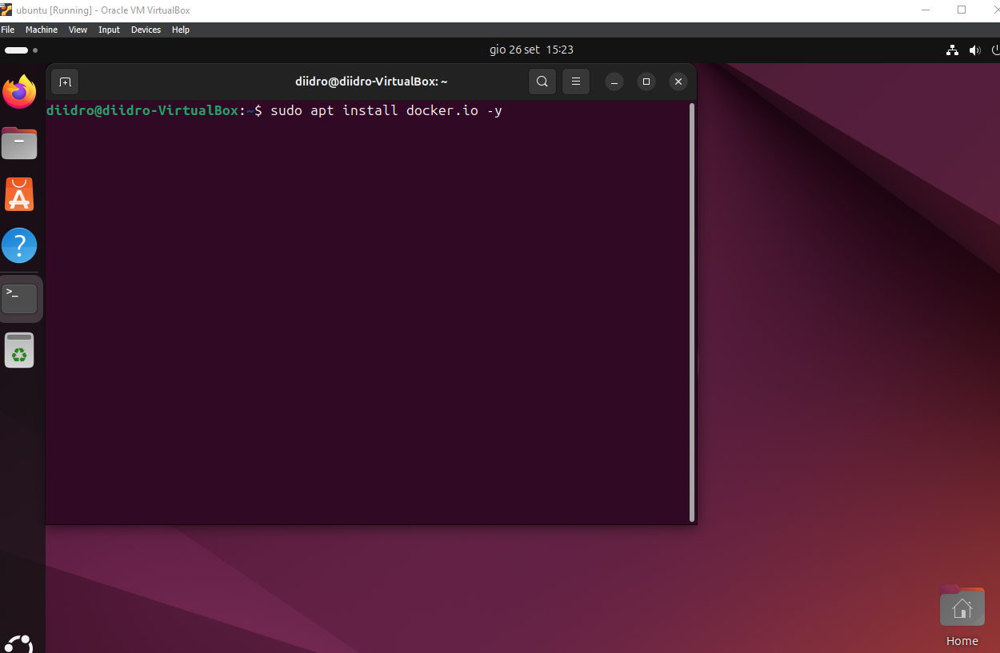
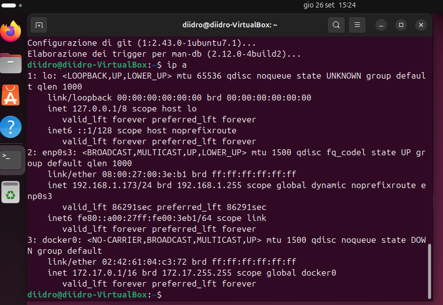
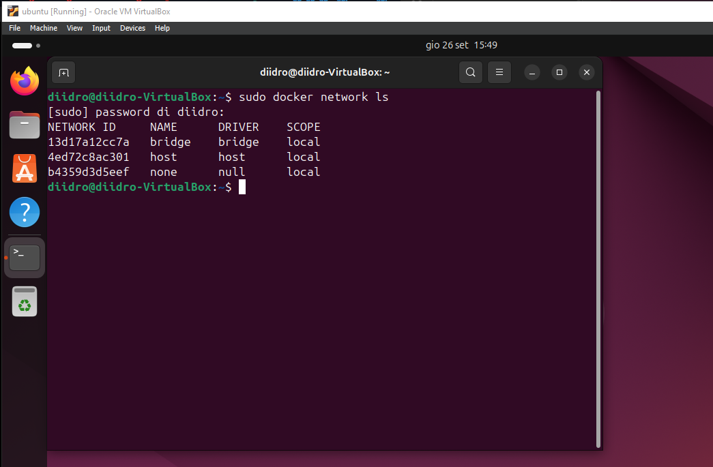

# Preparazione dell'ambiente
Dato il funzionamento dei docker, inizio dicendo che lavorerò utilizzando un kernel linux. 
Nel caso in cui il vostro sistema operativo sia Windows, ma volete ugualmente riprodurre questo laboratorio, vi consiglio di creare una VM al fine di runnare ubuntu e, su questo, installare i docker.

Creata la VM ed installato ubuntu, proseguite mettendo la VM in Bridge (capirete le motivazioni quando posterò, sotto, il disegno di rete che realizzeremo) ed effettuate l'update e l'upgrade dell'OS.
Siamo pronti per iniziare!

# Installazione di docker.io
Iniziamo ad installare il tool docker.io; in questa guida utilizzeremo solo il terminale, niente GUI!
L'installazione la puoi effettuare dando il seguente comando:

Terminata l'installazione, dando il comando "ip a" possiamo notare come sia comparsa una nuova interfaccia di rete: docker0.

Piccola degressione sulle schede di rete appena visualizzate:
- **lo**, è il loopback, ovvero un'interfaccia di rete virtuale che permette al sistema di comunicare con se stesso;
- **enp0s3**, un'interfaccia di rete fisica (essendo in bridge siamo nella stessa subnet del nostro host);
- **docker0**, un'interfaccia di rete virtuale creata da Docker, è il netwoek per il default bridge.

---

Per vedere i vari network ci basta digitare il seguente comando:

Di questa immagine dobbiamo fare attenzione a:
- **Name**, indica il nome del network;
- **Driver**, sezione che indica la tipologia di network.

---
[Capitolo 2](Chapter2-Docker.md)
