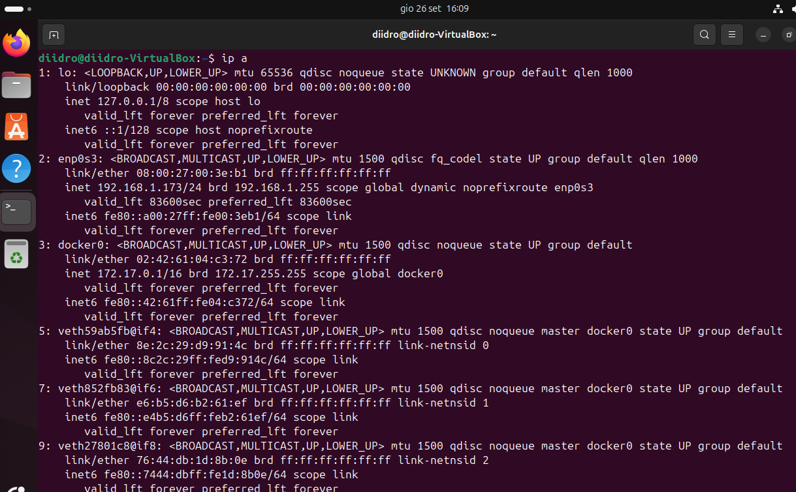
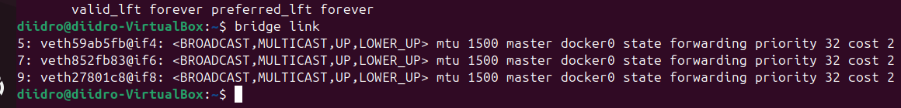
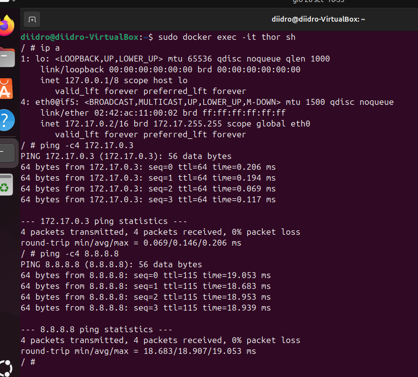
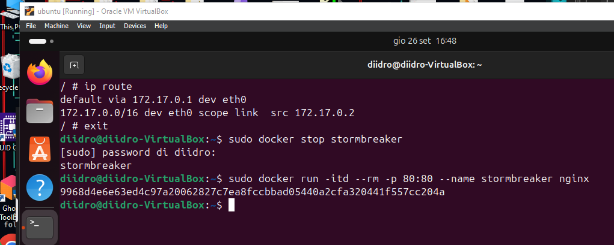
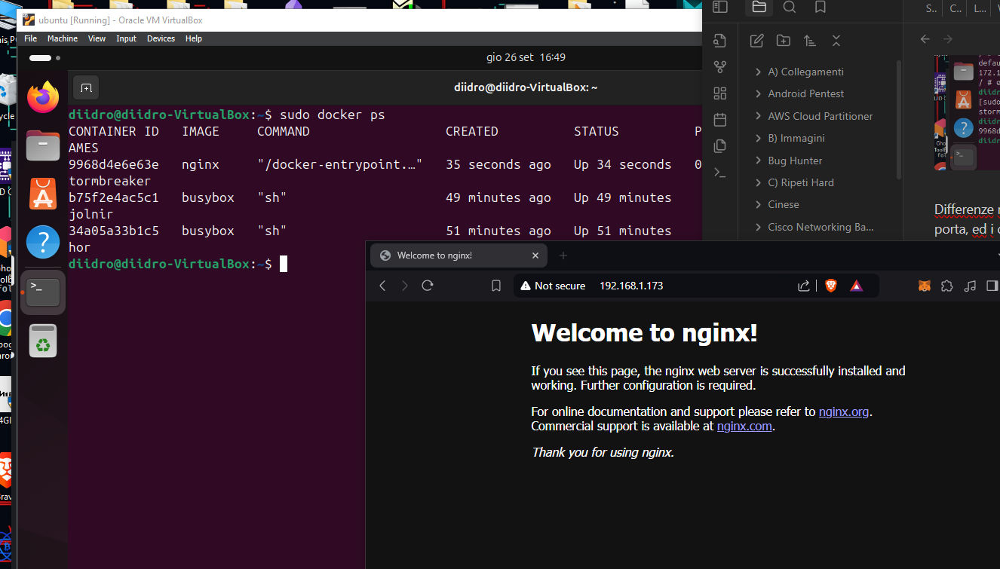

# Preparazione dell'ambiente
Dato il funzionamento dei docker, inizio dicendo che lavorerò utilizzando un kernel linux. 
Nel caso in cui il vostro sistema operativo sia Windows, ma volete ugualmente riprodurre questo laboratorio, vi consiglio di creare una VM al fine di runnare ubuntu e, su questo, installare i docker.

Creata la VM ed installato ubuntu, proseguite mettendo la VM in Bridge (capirete le motivazioni quando posterò, sotto, il disegno di rete che realizzeremo) ed effettuate l'update e l'upgrade dell'OS.
Siamo pronti per iniziare!

# Installazione di docker.io
Iniziamo ad installare il tool docker.io; in questa guida utilizzeremo solo il terminale, niente GUI!
L'installazione la puoi effettuare dando il seguente comando:

Terminata l'installazione, dando il comando "ip a" possiamo notare come sia comparsa una nuova interfaccia di rete: docker0.

Piccola degressione sulle schede di rete appena visualizzate:
- **lo**, è il loopback, ovvero un'interfaccia di rete virtuale che permette al sistema di comunicare con se stesso;
- **enp0s3**, un'interfaccia di rete fisica (essendo in bridge siamo nella stessa subnet del nostro host);
- **docker0**, un'interfaccia di rete virtuale creata da Docker, è il netwoek per il default bridge.

---

Per vedere i vari network ci basta digitare il seguente comando:

Di questa immagine dobbiamo fare attenzione a:
- **Name**, indica il nome del network;
- **Driver**, sezione che indica la tipologia di network.

# Comandi di base

Iniziamo, finalmente, la creazione del nostro primo container.
Vediamo, quindi, il comando da utilizzare per poi spiegarlo:

Analisi del comando:
- **itd**, sta ad indicare ***interactable*** and ***detached*** (ci permette di interagire con il docker e di isolarlo, avrà un settaggio di default);
- **rm**, indica che il ***container*** verrà ***automaticamente rimosso*** una volta che il processo al suo interno termina;
- **name**, definisce il nome del container (la parola che seguirà il comando sarà il nome);
- **busybox**, è il nome dell'immagine che utilizzeremo per il container (questa, nello specifico, è rapida e leggera).

Proseguiamo creando un secondo container, che chiamerà mjolnir, ed un terzo che, invece, chiamerò stormbreaker (per quest'ultimo utilizzerò la distro nginx, ovvero un web server open source utilizzato anche come proxy inverso, cache HTTP e bilanciatore di carico).

Dando il comando "sudo docker ps" potremmo farci stampare tuti i docker up:

Prima di illustrare il disegno di rete dobbiamo comprendere quanto abbiamo fatto.
Ad ogni generazione di ogni container non abbiamo mai definito nulla inerente al network dato che, questo, è stato settato di default.
Il default network ha fatto si di creare, in modo automatico, tre interfacce di rete virtuali per poi linkarle al Docker0 bridge che agirà come una specie di switch.
Ogni container generato si collegherà all'apposita interfaccia linkata al Docker0.

Ecco il disegno di rete:

---
[Capitolo 2](Chapter2-Docker.md)
