# Comandi di base

Iniziamo, finalmente, la creazione del nostro primo container.
Vediamo, quindi, il comando da utilizzare per poi spiegarlo:

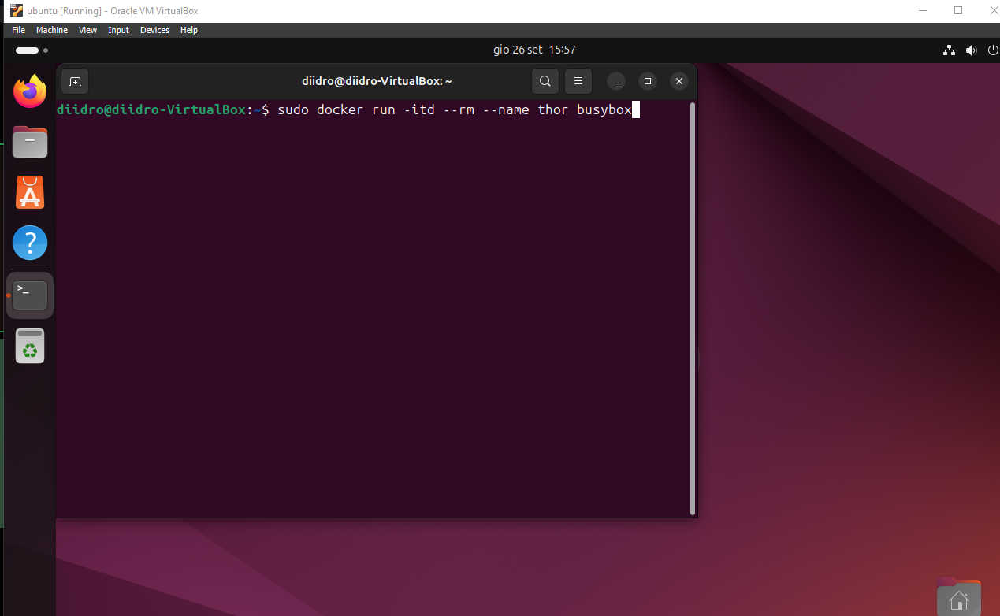

Analisi del comando:
- **itd**, sta ad indicare ***interactable*** and ***detached*** (ci permette di interagire con il docker e di isolarlo, avrà un settaggio di default);
- **rm**, indica che il ***container*** verrà ***automaticamente rimosso*** una volta che il processo al suo interno termina;
- **name**, definisce il nome del container (la parola che seguirà il comando sarà il nome);
- **busybox**, è il nome dell'immagine che utilizzeremo per il container (questa, nello specifico, è rapida e leggera).

Proseguiamo creando un secondo container, che chiamerà mjolnir, ed un terzo che, invece, chiamerò stormbreaker (per quest'ultimo utilizzerò la distro nginx, ovvero un web server open source utilizzato anche come proxy inverso, cache HTTP e bilanciatore di carico).

Dando il comando "sudo docker ps" potremmo farci stampare tuti i docker up:

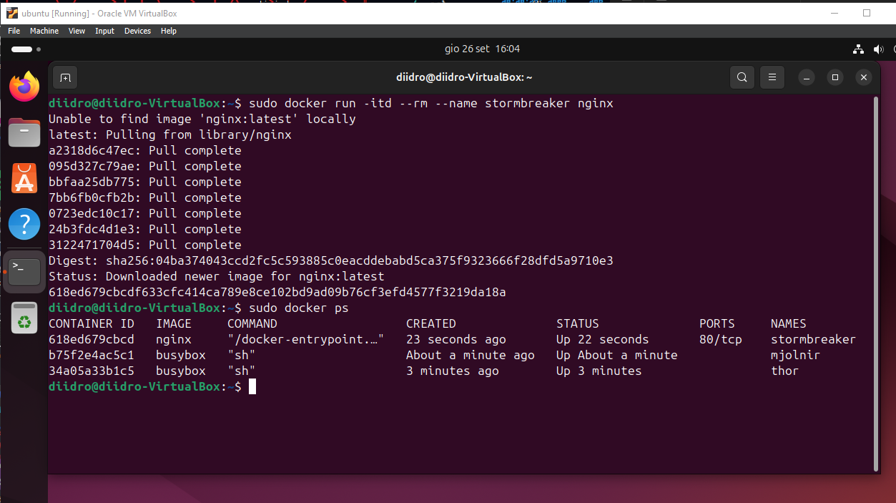

Prima di illustrare il disegno di rete dobbiamo comprendere quanto abbiamo fatto.
Ad ogni generazione di ogni container non abbiamo mai definito nulla inerente al network dato che, questo, è stato settato di default.
Il default network ha fatto si di creare, in modo automatico, tre interfacce di rete virtuali per poi linkarle al Docker0 bridge che agirà come una specie di switch.
Ogni container generato si collegherà all'apposita interfaccia linkata al Docker0.

Ecco il disegno di rete:

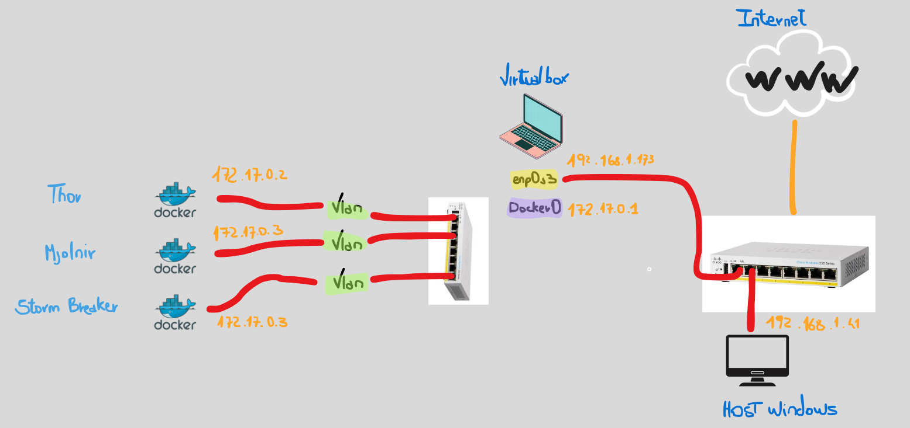

Come prova del nove possiamo lanciare un "ip a" e vedere come la situazione si sia modificata:

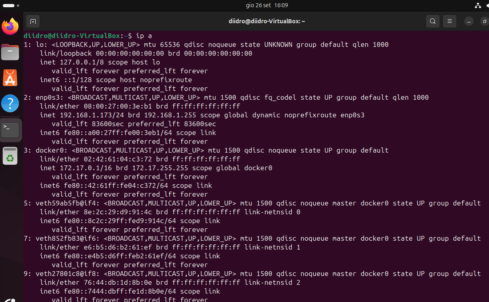

Ecco le nostre tre nuove interfacce di rete.
Per ottenere più informazioni sulle stesse, possiamo dare il comando bridge link. 
Ecco cosa verrà stampato:

Abbiamo ottenuto informazioni sul nome, ed evidenziato che tali interfacce siano connesse a docker0.

# L'importanza delle informazioni ed il ruolo di ispect

Possiamo ottenere informazioni grossomodo su ogni cosa, persino su un network (che identificheremo tramite il nome assegnatogli), come nell'immagine sotto:

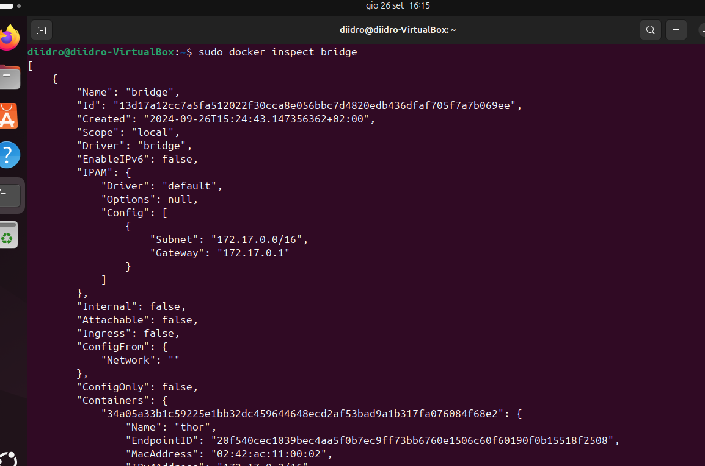

Verranno stampate molte informazioni; è facile intuire, tuttavia, come ogni blocco di codice faccia riferimento ad un container, identificato dal tag "Name".
Informazione utile è l'IP address assegnato ad ogni uno di loro, IP assegnato tramite DHCP nel network bridge precedentemente creato.
Dal momento che il network Docker0 agisce come uno switch, i tre container sono già capaci di comunicare tra di loro.

Proviamo, quindi, ad entrare in uno dei docker generati ed in esecuzione.

Il comando per entrare è il seguente:

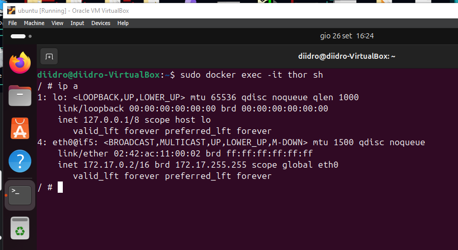

Ove:
- ***docker exec***, è il comando utile ad eseguire comandi all'interno di un container in esecuzione, non crea un nuovo container ma si aggancia ad uno già esistente (definito tramite il nome inserito dopo -it);
- ***it***, in realtà questa è l'unione di i (interattivo) e t (pseudo-TTY). 
	- i, permette all'utente di interagire con il processo;
	- t, alloca uno pseudo-terminal per il comando, simulando un terminale per permettere un'interazione naturale;
- ***sh***, indica il comando da eseguire all'interno del container (spawn di shell interattiva nel container).

Dando, poi, ip a, possiamo notare come ci mostri, effettivamente, la scheda di rete del docker in questione.
Proviamo, quindi, a testare la connettività con gli altri docker pingandoli (usiamo il protocollo ICMP).

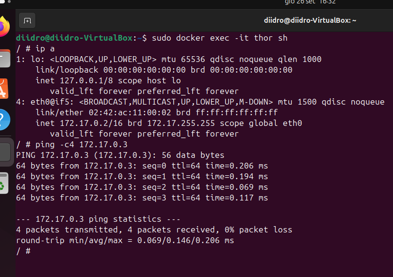

Possiamo, in virtù del network impostato, pingare anche in rete, proviamo a farlo verso google:

Volendo vedere la route basta dare il classico comando da terminale (restando nel docker selezionato):

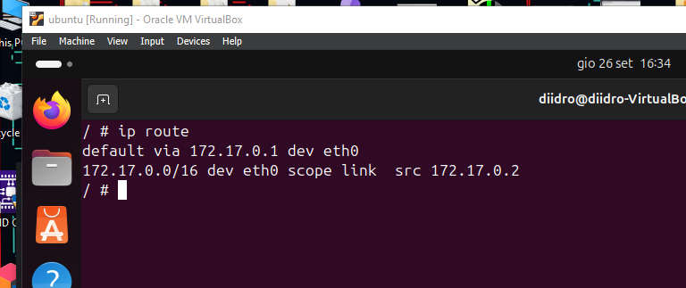

Il merito del raggiungimento della rete da parte del nostro docker è dovuto al NAT.

# Esposizione dei serivizi hostati sul docker

Nel nostro disegno di rete, tuttavia, possiamo vedere il docker Stormbreaker (avente ip 172.17.0.4) che possiede un sito web sulla porta 80.

Proviamo ad accedervi tramite il nostro pc host (quello che ospita la VM sulla quale stiamo facendo girare i dockers).
Possiamo passare per l'ip 192.168.1.173 (IP address dell'host dei docker) ed andare alla porta 80?

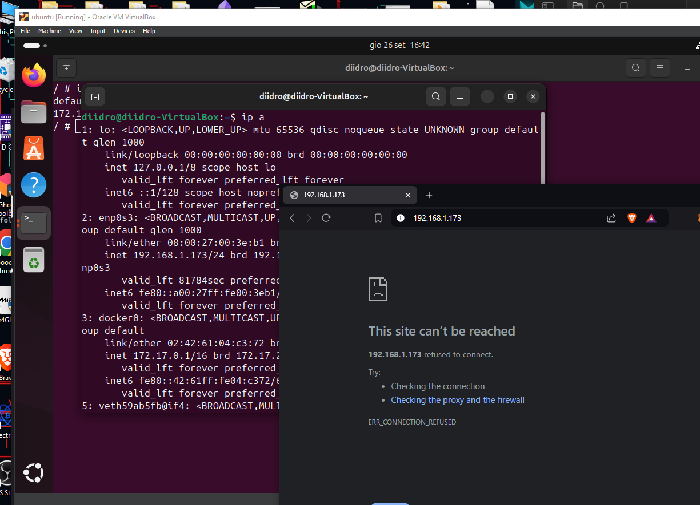

Non possiamo, almeno per ora.
Questa è una delle problematiche del bridge network: se vogliamo accedere ai servizi che i nostri containers docker possono offrire (come un sito web in questo caso), dovremmo, manualmente, esporre questi servizi.

Proseguiamo, allora, esponendo la porta 80 in modo da garantirci un accesso; per farlo dobbiamo eliminare, e poi risviluppare, stormbreaker dato che servirà un comando specifico.
Proseguiamo, quindi, eliminandolo.

Il primo comando è utilizzato per stoppare il container (avendo definito, durante la creazione, l'oggetto --rm non appena questo andrà in stop verrà eliminato), il secondo comando, invece, è utilizzato per creare un nuovo container avente la porta che ci interessa biddata a quella dell'host.

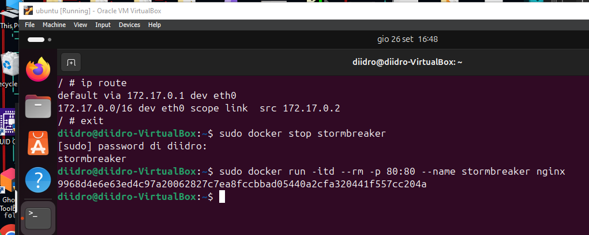

Differenze nel comando sono sicuramente l'oggetto -p, per specificare la porta, ed i due numeri 80:80. 
Questa sintassi serve per specificare le due porte da biddare: **la porta prima** dei due punti indica la porta dell'host ospitante il docker, da biddare alla **porta sita a destra** dei due punti, porta del docker.

Come prova delle modifiche effettuate, lanciamo docker ps:

Refreshando la paggina precedente, ora funzionerà!

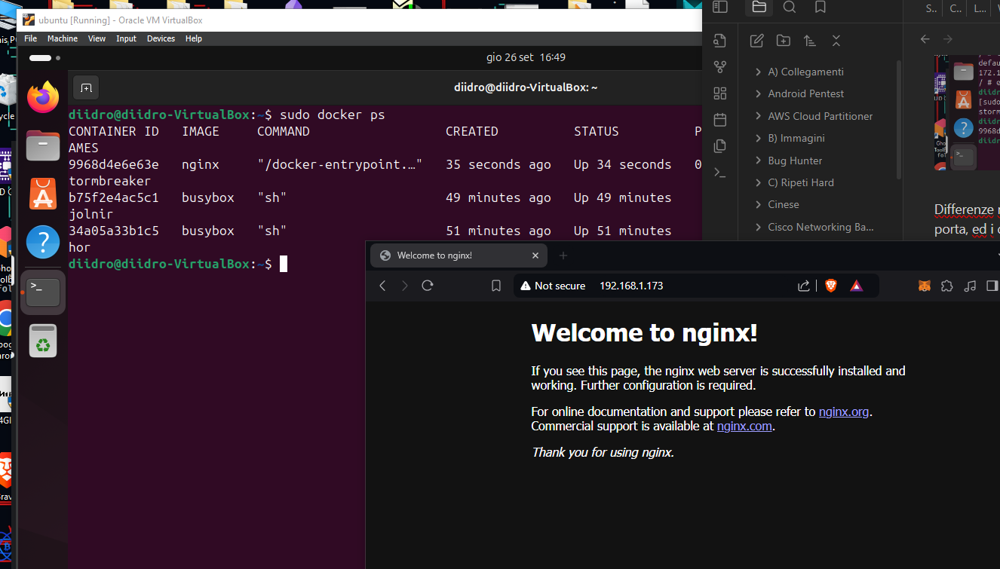

